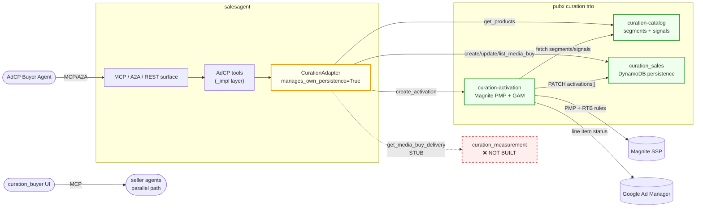
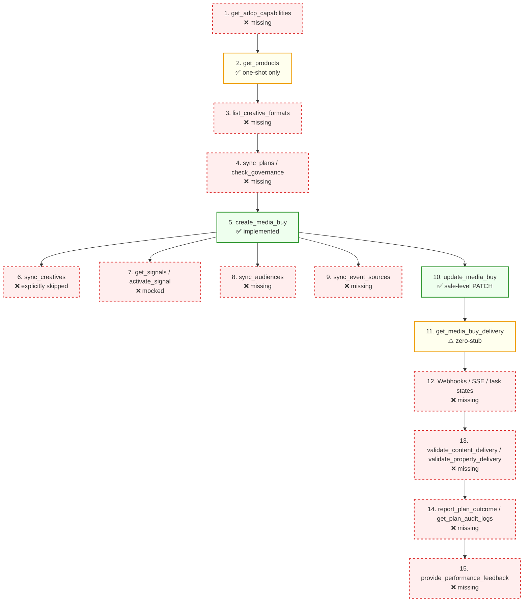

# Curation Path Audit — Media Buy Flow vs. AdCP Spec

> Audit date: 2026-04-24
> Spec source: <https://docs.adcontextprotocol.org/llms.txt>
> Repos reviewed: `salesagent` (CurationAdapter), `curation_buyer`, `curation_sales`, `curation-activation`

> **Correction note (2026-04-24):** An earlier revision of this doc referenced `list_authorized_properties` as an AdCP tool. That tool does **not** exist in AdCP v3. Property governance in the spec is a two-part contract: a static `.well-known/adagents.json` declaration + a runtime `validate_property_delivery` check. This doc has been corrected.

---

## Architecture

- `salesagent` exposes the AdCP surface (MCP + A2A + REST) and owns `CurationAdapter`, which delegates to the pubx trio.
- `curation_sales` is a DynamoDB-backed persistence layer for deals/campaigns (AdCP-aligned schema).
- `curation-activation` translates CEL rules + signals into Magnite PMP deals + RTB rules and GAM status changes.
- `curation-catalog` is the source of truth for segments (products) and signals.
- `curation_buyer` is an independent buyer-side UI talking to seller agents over MCP — it is not consumed by the adapter today.
- `curation_measurement` is referenced in adapter comments but does not exist yet.

### Media buy lifecycle — implementation heat map

---

## ✅ What we already have

- **`get_products`** — segments from curation-catalog mapped to AdCP `Product`.
- **`get_media_buys` / `update_media_buy` / `create_media_buy`** — CRUD against curation_sales, with deal ↔ campaign discrimination preserved end-to-end.
- **AdCP-aligned schema** in curation_sales (`DealDsp`, `DealPricing`, `platform_id`, `start_time`) + legacy back-compat layer.
- **CEL → Magnite targeting** translation + PMP deal + RTB rule creation in curation-activation; GAM order-level status propagation.
- **Admin plumbing** — test-connection endpoint for pubx service URLs; `manages_own_persistence = True` correctly bypasses Postgres for curation tenants.

## ❌ What we're missing

Roughly 60% of the AdCP media-buy surface is stubbed or absent. Highest-impact gaps:

- **`sync_creatives` explicitly skipped** (`src/core/tools/creatives/_sync.py:102-106`) — no creative upload, approval, or update path.
- **`get_media_buy_delivery` is a zero-stub** (`adapter.py:708`) — no real impressions / spend / pacing; `curation_measurement` service is not built.
- **No async task lifecycle, no RFC 9421 webhooks, no SSE** — activation is sync-or-nothing, failures are unrecoverable.
- **`list_creative_formats`, `.well-known/adagents.json`, `validate_property_delivery`** — creative-format and property-governance contracts unimplemented.
- **Signals path is mocked** — `get_signals` / `activate_signal` don't touch catalog or activation; `sync_audiences` / `sync_event_sources` absent.
- **Governance stack absent** — `sync_plans` / `check_governance`, Content Standards CRUD, `get_creative_features`, `get_media_buy_artifacts`, `report_plan_outcome`, `get_plan_audit_logs`, `provide_performance_feedback`, `log_event`.
- **Handshake gaps** — no `get_adcp_capabilities`, no iterative-refinement `get_products`, no collections/installments metadata, no `sync_catalogs`.
- **Accounts protocol** — see dedicated section below; today's `buyer-accounts` endpoint is not AdCP-compliant.

---

## 📋 Work items — per protocol surface

Legend: **P0** = breaks AdCP contract · **P1** = major spec gap · **P2** = nice-to-have · **P3** = hardening

### Discovery & handshake

| # | Priority | Tool / concept | Task |
|---|---|---|---|
| D1 | P0 | `get_adcp_capabilities` | Expose the capability probe through CurationAdapter (step 1 of any handshake) |
| D2 | P2 | `get_products` (refinement mode) | Add iterative refinement (brief → adjust → re-curate without commit) — the core *curation handshake* |
| D3 | P2 | Collections / installments | Add collections / installments metadata to catalog segments and propagate to AdCP `Product` (podcast episodes, CTV seasons) |
| D4 | P2 | `sync_catalogs` | Implement publisher product-feed push into curation-catalog |

### Creatives

| # | Priority | Tool / concept | Task |
|---|---|---|---|
| C1 | P0 | `sync_creatives` | Implement end-to-end (adapter → curation_sales → curation-activation) with upsert, idempotency, asset persistence. Remove the explicit skip in `src/core/tools/creatives/_sync.py:102-106` |
| C2 | P0 | `list_creative_formats` | Source from catalog / registry and surface through the adapter |
| C3 | P1 | Creative approval workflow | Build approval state machine + buyer notification; validate `format_id` against the catalog on submission |
| C4 | P1 | `build_creative` | Implement 3-tier natural-language generation (static → asset group → per-context) |
| C5 | P1 | `preview_creative` | Implement single + batch preview rendering |
| C6 | P1 | `list_creatives` | Implement browse / filter by format, status, concept, tags |

### Delivery & reporting

| # | Priority | Tool / concept | Task |
|---|---|---|---|
| R1 | P0 | `get_media_buy_delivery` + `curation_measurement` | Build (or stub) `curation_measurement` and wire `get_media_buy_delivery` to return real impressions / spend / pacing / dimensional data (replace the zero-stub at `adapter.py:708`) |
| R2 | P1 | `provide_performance_feedback` | Implement the buyer → publisher optimization loop |
| R3 | P2 | Delivery cache refresh | Add a scheduled refresh job for cached media-buy delivery metrics |

### Governance, compliance & audit

| # | Priority | Tool / concept | Task |
|---|---|---|---|
| G1 | P0 | `.well-known/adagents.json` + `validate_property_delivery` | Publish the authorized-properties declaration and implement the runtime supply-path authorization check |
| G2 | P1 | `sync_plans` + `check_governance` | Enforce the governance gate before `create_media_buy` executes |
| G3 | P1 | Content Standards CRUD | Implement `create_content_standards` / `get_content_standards` / `list_content_standards` / `update_content_standards` / `calibrate_content` / `validate_content_delivery` |
| G4 | P1 | `get_creative_features` + `get_media_buy_artifacts` | Implement creative-governance evaluation and content-context retrieval |
| G5 | P1 | `report_plan_outcome` + `get_plan_audit_logs` | Implement plan outcome reporting and the audit-log surface |
| G6 | P1 | `log_event` | Implement conversion-event ingestion |

### Accounts protocol

> Spec: <https://docs.adcontextprotocol.org/docs/accounts/overview>
>
> Accounts represent the brand / operator / vendor-agent commercial triangle. Each account has a lifecycle (`pending_approval` → `active` → `payment_required` / `suspended` / `closed`) and governs which rates apply, which operations are permitted, and how consumption is reported back for revenue verification.
>
> **Current state in our stack:** `curation_sales` exposes a non-AdCP `PUT/GET /api/v1/buyer-accounts/{buyer_id}` that stores DSP / SSP routing config. This is *not* the AdCP Accounts protocol — it does not carry brand identity, account state, billing party, or consumption reporting. Treat the entire Accounts surface as missing.

| # | Priority | Tool / concept | Spec requirement | Task |
|---|---|---|---|---|
| AC1 | P1 | `sync_accounts` | Conditional (required when `require_operator_auth: false` — implicit accounts) | Declare brand / operator pairs + billing and provision implicit accounts |
| AC2 | P1 | `list_accounts` | Conditional (required when `require_operator_auth: true` — explicit accounts) | Discover existing accounts and poll approval status |
| AC3 | P1 | `report_usage` | Required | Report service consumption back to vendor agents after delivery (feeds revenue verification) |
| AC4 | P2 | `get_account_financials` | Optional | Expose spend / credit / invoice status per account |
| AC5 | P2 | `sync_governance` | Optional | Sync governance-agent endpoints onto accounts for seller-side validation |
| AC6 | P1 | Account lifecycle | Required | Model account states (`pending_approval` / `active` / `payment_required` / `suspended` / `closed`) and gate operations by status |
| AC7 | P1 | Brand registry + `brand.json` | Required | Resolve brand identity and honour `authorized_operators` declared in `brand.json` when provisioning accounts |
| AC8 | P2 | `require_operator_auth` | Required | Surface this setting per tenant and branch between `sync_accounts` (implicit) and `list_accounts` (explicit) flows |
| AC9 | P2 | Migration | — | Decide the migration path for the existing non-AdCP `buyer-accounts` endpoint (deprecate, or map forward into `sync_accounts` semantics) |

### General AdCP compliance (async, ops & hardening)

| # | Priority | Tool / concept | Task |
|---|---|---|---|
| X1 | P0 | Task lifecycle states | Implement AdCP task states (`submitted` / `working` / `input-required` / `completed` / `failed`) on all long-running operations |
| X2 | P0 | Webhooks (RFC 9421) | Implement signed webhook dispatcher with legacy HMAC fallback |
| X3 | P1 | SSE streaming | Add Server-Sent Events for interactive curation workflows (refinement loops, creative generation) |
| X4 | P2 | Deal deactivation | Add a deal-deactivation endpoint in curation-activation; call it on sale cancellation (today Magnite deals are orphaned) |
| X5 | P2 | Activation rollback | Add rollback / compensating actions when RTB-rule creation fails after PMP-deal creation |
| X6 | P3 | Integration test coverage | Tests for `create_media_buy`, `update_media_buy`, deal activation, creative assignment, activation-failure recovery |
| X7 | P3 | Resilience | Circuit breaker + retry around sales / activation / catalog HTTP clients |
| X8 | P3 | AuthN / AuthZ | API keys or service-mesh mTLS on curation_sales and curation-activation |
| X9 | P3 | Soft delete + audit trail | Replace hard deletes on sales with soft-delete + audit trail |
| X10 | P3 | curation_buyer direction | Decide whether curation_buyer converges onto CurationAdapter or stays an independent MCP client; align schemas if converging |

